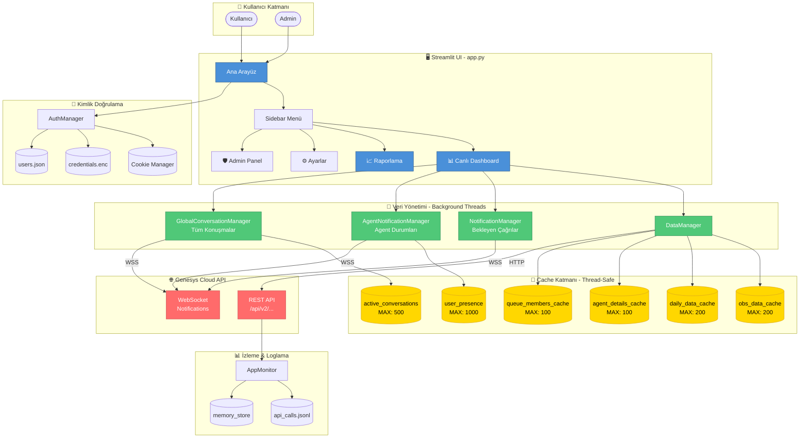
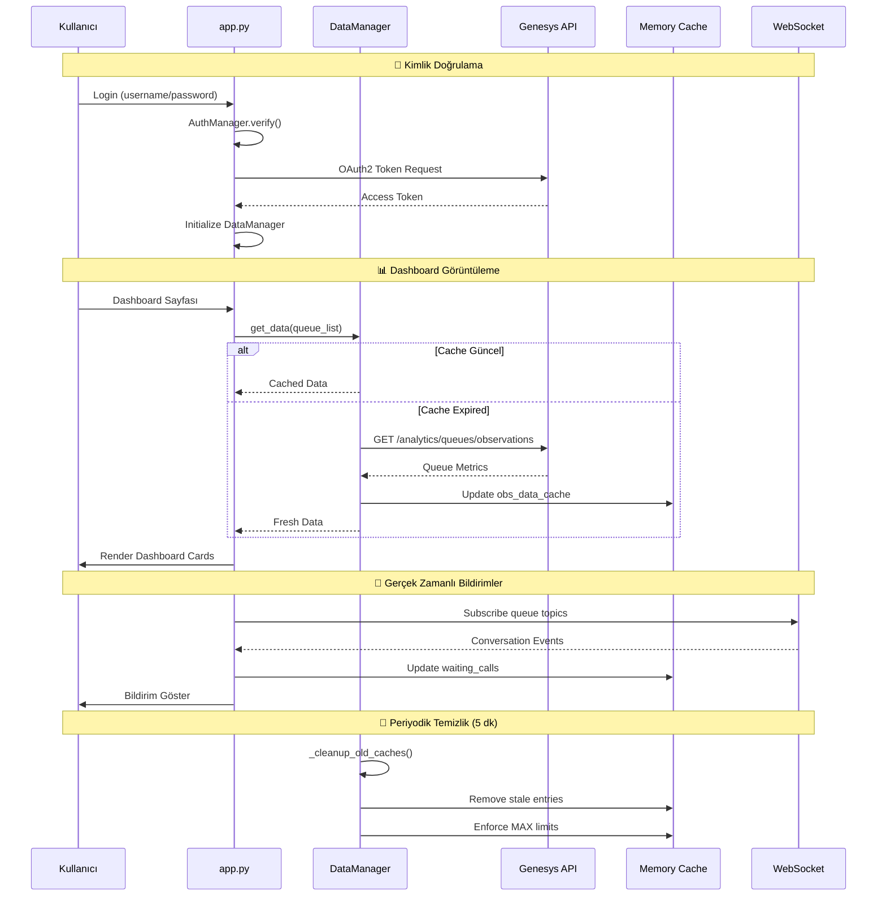

# Genesys Cloud Reporting & Live Dashboard

Bu uygulama, Genesys Cloud platformu için gerçek zamanlı dashboard ve geçmişe dönük raporlama çözümü sunar.

## ✨ Özellikler

### 🔐 Kimlik Doğrulama & Güvenlik
- **Çok Kullanıcılı Profil Sistemi:** Admin, Manager, Reports User, Dashboard User rolleri
- **AES-256 Şifrelemeli Credential Saklama:** Tüm API anahtarları güvenli şekilde saklanır
- **Çoklu Organizasyon Desteği:** Aynı sunucuda farklı Genesys org'ları yönetilebilir
- **Session Yönetimi:** Cookie tabanlı otomatik oturum devamı

### 📊 Canlı Dashboard
- **Gerçek Zamanlı Kuyruk Metrikleri:** Bekleyen, Görüşmede, Müsait Agent sayıları
- **WebSocket Bildirimler:** Anlık çağrı ve agent durumu güncellemeleri
- **Özelleştirilebilir Kartlar:** Drag-drop düzenleme, renk ve threshold ayarları
- **Otomatik Yenileme:** Ayarlanabilir refresh interval (5-60 saniye)

### 📈 Raporlama
- **Agent & Kuyruk Performans Raporları:** Günlük/haftalık/aylık metrikler
- **Detaylı Konuşma Analizleri:** Çağrı süreleri, bekleme, ACW, transfer metrikleri
- **Çoklu Export Formatları:** Excel, CSV, Parquet, PDF
- **Interval Bazlı Gruplama:** 15dk, 30dk, saatlik, günlük gruplamalar

### ⚡ Performans & Bellek Yönetimi
- **Otomatik Cache Temizleme:** Tüm cache'ler için MAX boyut limitleri
- **Background Thread Yönetimi:** DataManager, NotificationManager'lar
- **Bellek İzleme:** Gerçek zamanlı RSS takibi ve otomatik cleanup
- **Rate Limiting:** API çağrı hız kontrolü

---

## 🚀 Dağıtım Seçenekleri (Production)

### Bağımsız Çalıştırılabilir Dosya
GitHub Actions üzerinden her sürüm için otomatik olarak **Linux** ve **Windows** binary'leri oluşturulur.
- Release sekmesinden indirip doğrudan çalıştırabilirsiniz
- Python kurulumuna gerek yoktur

---

## 🛠️ Yerel Geliştirme

1. **Bağımlılıkları Yükleyin:**
   ```bash
   pip install -r requirements.txt
   ```

2. **Uygulamayı Başlatın:**
   ```bash
   streamlit run app.py
   # veya
   python run_app.py
   ```

3. **Varsayılan Admin Girişi:**
   - Kullanıcı: `admin`
   - Şifre: `admin` (ilk girişte değiştirilmeli)

---

## 🧱 Proje Yapısı

```
├── app.py                 # Ana Streamlit arayüzü (3800+ satır)
├── run_app.py             # Başlatıcı script (port kontrolü, single instance)
├── Dockerfile             # Container yapılandırması
├── requirements.txt       # Python bağımlılıkları
│
├── src/
│   ├── api.py             # Genesys Cloud REST API entegrasyonu
│   ├── auth.py            # OAuth2 token yönetimi
│   ├── auth_manager.py    # Kullanıcı/rol yönetimi
│   ├── data_manager.py    # Background veri çekme (thread-safe cache)
│   ├── notifications.py   # WebSocket notification manager'lar
│   ├── processor.py       # Veri işleme ve metrik hesaplama
│   ├── monitor.py         # API kullanım istatistikleri
│   └── lang.py            # Çoklu dil desteği (TR/EN)
│
├── orgs/                  # Organizasyon verileri
│   └── {org_code}/
│       ├── credentials.enc    # Şifrelenmiş API credentials
│       ├── users.json         # Kullanıcı hesapları
│       └── dashboard_config.json
│
└── logs/
    ├── app.log            # Uygulama logları
    ├── api_calls.jsonl    # API çağrı geçmişi
    └── memory.jsonl       # Bellek kullanım trendi
```

---

## 📐 Sistem Mimarisi



---

## 🔄 Veri Akışı Detayı



---

## 🔒 Güvenlik

| Özellik | Açıklama |
|---------|----------|
| **Şifreleme** | AES-256 (Fernet) ile credential şifreleme |
| **Anahtar Yönetimi** | `.secret.key` dosyası ile anahtar izolasyonu |
| **Parola Hash** | bcrypt ile güvenli parola saklama |
| **Session** | Encrypted cookie ile session yönetimi |
| **Dosya İzinleri** | 0o600 ile anahtar dosyası koruması |

> ⚠️ **Önemli:** Sunucu taşırken `.secret.key` ve `credentials.enc` dosyalarını birlikte taşıyın.

---

## 🧹 Bellek Yönetimi

Uygulama, bellek sızıntılarını önlemek için kapsamlı cache yönetimi içerir:

| Cache | MAX Limit | Temizlik |
|-------|-----------|----------|
| `obs_data_cache` | 200 queue | 5 dk periyodik |
| `daily_data_cache` | 200 queue | 5 dk periyodik |
| `agent_details_cache` | 100 queue | 5 dk periyodik |
| `queue_members_cache` | 100 queue | 5 dk periyodik |
| `user_presence` | 1000 user | 90 sn periyodik |
| `user_routing` | 1000 user | 90 sn periyodik |
| `active_calls` | 500 call | 90 sn periyodik |
| `active_conversations` | 500 conv | 45 sn periyodik |
| `waiting_calls` | 500 call | 45 sn periyodik |

**Otomatik Cleanup Tetikleme:** RSS > 1024 MB olduğunda `_soft_memory_cleanup()` çalışır.

---

## 📝 Environment Variables

| Değişken | Varsayılan | Açıklama |
|----------|------------|----------|
| `GENESYS_MEMORY_LIMIT_MB` | 1024 | Bellek cleanup tetikleme limiti |
| `GENESYS_MEMORY_CLEANUP_COOLDOWN_SEC` | 120 | Cleanup arası minimum süre |
| `API_LOG_MAX_BYTES` | 50MB | API log dosyası max boyutu |
| `API_LOG_MAX_FILES` | 5 | Rotate edilecek log dosyası sayısı |

---

## 📄 Lisans

Bu proje özel kullanım içindir.
