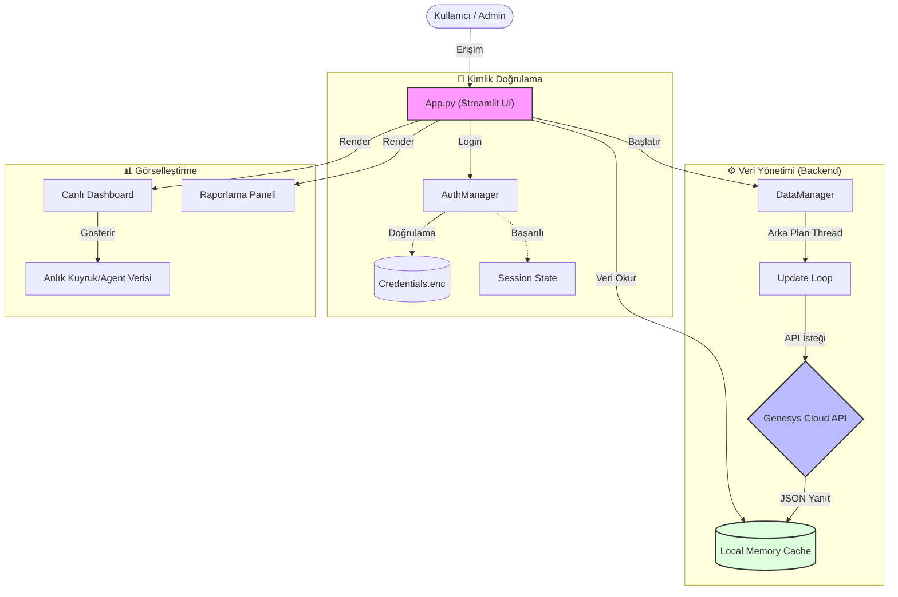

# Genesys Cloud Reporting & Live Dashboard

Bu uygulama, Genesys Cloud platformu için gerçek zamanlı dashboard ve geçmişe dönük raporlama çözümü sunar.

## ✨ Özellikler
- **Canlı Dashboard:** Kuyruk bazlı "Görüşmede", "Müsait Agent" ve "On Queue" metriklerinin takibi.
- **Detaylı Raporlama:** Agent ve Kuyruk bazlı performans raporları (Excel export desteği).
- **Güvenli Giriş:** Credentials verileri AES şifreleme ile yerel olarak korunur.
- **Hafif ve Hızlı:** Genesys SDK bağımlılığı kaldırılmış, doğrudan HTTP API entegrasyonu.

---

## 🚀 Dağıtım Seçenekleri (Production)

### 1. Web Uygulaması (Docker)
Uygulamayı bir sunucuda veya bulutta web uygulaması olarak çalıştırmak için Docker kullanabilirsiniz.

```bash
# Image oluşturma
docker build -t genesys-dashboard .

# Çalıştırma
docker run -d -p 8501:8501 --name reporting-app genesys-dashboard
```

### 2. Bağımsız Çalıştırılabilir Dosya (Stand-alone Binary)
GitHub Actions üzerinden her sürüm için otomatik olarak **Linux** bin ve **Windows .exe** dosyaları oluşturulmaktadır. 
- **Release** sekmesinden ilgili dosyayı indirip doğrudan çalıştırabilirsiniz.
- Python kurulumuna gerek duymaz.

---

## 🛠️ Yerel Geliştirme (Local Development)

1. **Bağımlılıkları Yükleyin:**
   ```bash
   pip install -r requirements.txt
   ```

2. **Uygulamayı Başlatın:**
   ```bash
   streamlit run app.py
   ```

---

## 🧱 Proje Yapısı
- `app.py`: Ana Streamlit arayüzü ve dashboard mantığı.
- `src/api.py`: Genesys Cloud API entegrasyon katmanı.
- `src/processor.py`: Veri işleme ve metrik hesaplama mantığı.
- `src/lang.py`: Çoklu dil desteği (TR/EN).
- `.github/workflows/`: CI/CD (Otomatik build) yapılandırması.

---

## � Uygulama Akışı
Aşağıdaki diyagram, uygulamanın veri akışını ve bileşenler arasındaki ilişkiyi göstermektedir.



---

## �🔒 Güvenlik
Uygulama, ilk girişte bir `.secret.key` dosyası oluşturur. `credentials.enc` dosyası bu anahtar ile şifrelenir. 
> **Önemli:** Eğer sunucu değiştirirseniz veya dosyaları taşırsanız, her iki dosyayı da birlikte taşımanız gerekir.
