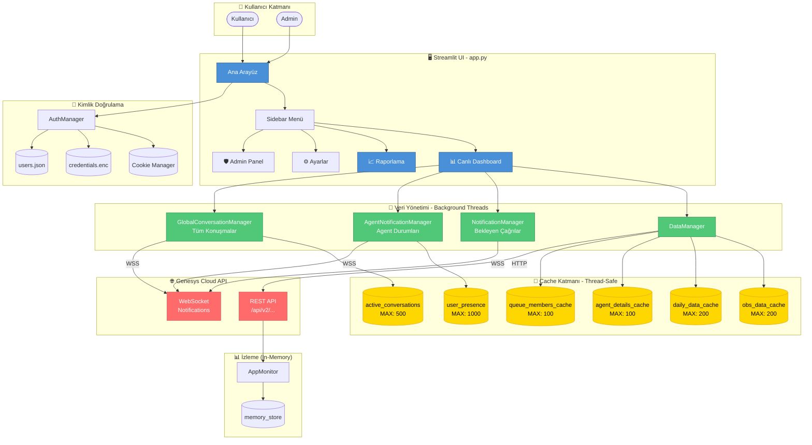
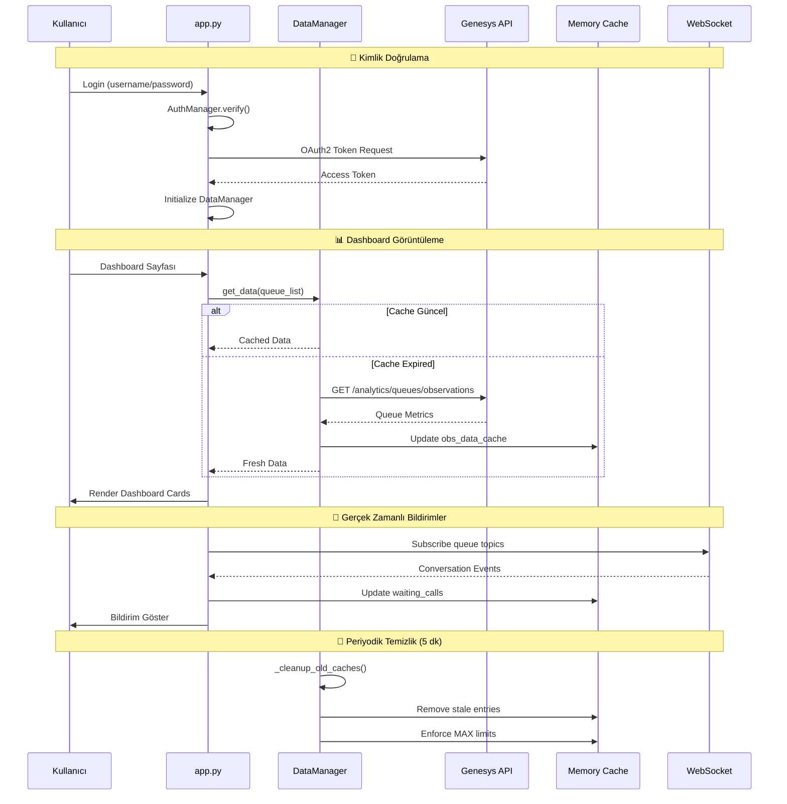

# Genesys Cloud Reporting & Live Dashboard

Bu uygulama, Genesys Cloud platformu için gerçek zamanlı dashboard ve geçmişe dönük raporlama çözümü sunar.

## ✨ Özellikler

### 🔐 Kimlik Doğrulama & Güvenlik
- **Çok Kullanıcılı Profil Sistemi:** Admin, Manager, Reports User, Dashboard User rolleri
- **AES-256 Şifrelemeli Credential Saklama:** Tüm API anahtarları güvenli şekilde saklanır
- **Çoklu Organizasyon Desteği:** Aynı sunucuda farklı Genesys org'ları yönetilebilir
- **Session Yönetimi:** Cookie tabanlı otomatik oturum devamı

### 📊 Canlı Dashboard
- **Gerçek Zamanlı Kuyruk Metrikleri:** Bekleyen, Görüşmede, Müsait Agent sayıları
- **WebSocket Bildirimler:** Anlık çağrı ve agent durumu güncellemeleri
- **Özelleştirilebilir Kartlar:** Drag-drop düzenleme, renk ve threshold ayarları
- **Otomatik Yenileme:** Ayarlanabilir refresh interval (5-60 saniye)

### 📈 Raporlama
- **Agent & Kuyruk Performans Raporları:** Günlük/haftalık/aylık metrikler
- **Detaylı Konuşma Analizleri:** Çağrı süreleri, bekleme, ACW, transfer metrikleri
- **Çoklu Export Formatları:** Excel, CSV, Parquet, PDF
- **Interval Bazlı Gruplama:** 15dk, 30dk, saatlik, günlük gruplamalar

### ⚡ Performans & Bellek Yönetimi
- **Otomatik Cache Temizleme:** Tüm cache'ler için MAX boyut limitleri
- **Background Thread Yönetimi:** DataManager, NotificationManager'lar
- **Bellek İzleme:** Gerçek zamanlı RSS takibi ve otomatik cleanup (in-memory)
- **Rate Limiting:** API çağrı hız kontrolü

---

## 🚀 Dağıtım Seçenekleri (Production)

### Docker (GitHub Build -> GHCR)
GitHub Actions, `ghcr.io/<owner>/genesys-cloud-reporting` imajını otomatik üretir.

Örnek canlı çalıştırma:
```bash
IMAGE_REPOSITORY=ghcr.io/<owner>/genesys-cloud-reporting IMAGE_TAG=latest docker compose up -d
```

### Windows EXE (GitHub Artifact/Release)
GitHub Actions her `main/master` push'unda otomatik tag + release üretir.
- Önce benzersiz bir `v*` tag oluşturulur ve release açılır.
- Aynı akışta Linux binary (`GenesysReporting-linux`) ve Windows onedir paketi (`GenesysReporting-windows-onedir.zip`) build edilir.
- Linux/Windows binary build'leri GitHub Actions üzerinde Python 3.11 ile alınır.
- Windows build `--onedir` olarak alınır; her çalıştırmada yeni `_MEIxxxx` açılım klasörü üretilmez.
- Dosyalar otomatik olarak bu tag release'ine eklenir.
- Release/Artifact içinde izleme için `build-info-linux.txt` ve `build-info-windows.txt` bulunur.
- Güncellik doğrulaması için `build-info-*.txt` dosyalarındaki `sha` ve `python_version` alanlarını kontrol edin.

### Windows + IIS Reverse Proxy
Bu proje Streamlit tabanli oldugu icin IIS'te dogrudan host edilmez, reverse proxy olarak yayinlanir.

1. Uygulamayi sunucuda calistirin (`python run_app.py` veya Docker container).
2. Windows sunucuda su bilesenleri kurulu olmali:
   - IIS + WebSocket Protocol
   - URL Rewrite
   - Application Request Routing (ARR)
3. Repo icindeki kurulum scriptini **Administrator PowerShell** ile calistirin:
   ```powershell
   cd deploy\iis
   .\setup-iis-proxy.ps1 -SiteName "GeneysReporting" -HostName "rapor.sirket.com" -AppPort 8501 -ShowBindings
   ```
4. HTTPS baglamak icin sertifika thumbprint ile:
   ```powershell
   .\setup-iis-proxy.ps1 -SiteName "GeneysReporting" -HostName "rapor.sirket.com" -AppPort 8501 -EnableHttps -CertThumbprint "THUMBPRINT" -ShowBindings
   ```

Notlar:
- IIS tarafinda olusan `web.config`, `deploy/iis/web.config.template` dosyasindan uretilir.
- Uygulama `localhost:8501` uzerinde kalmali, disariya sadece IIS (80/443) acilmalidir.
- `-ShowBindings` tum IIS site bindinglerini listeler; port/host cakismasini tespit etmek icin kullanin.

---

## 🛠️ Yerel Geliştirme

1. **Bağımlılıkları Yükleyin:**
   ```bash
   pip install -r requirements.txt
   ```

2. **Uygulamayı Başlatın:**
   ```bash
   streamlit run app.py
   # veya
   python run_app.py
   ```

3. **İlk Admin Girişi (Güvenli Bootstrap):**
   - Kullanıcı: `admin`
   - Organizasyon: `default`
   - `GENESYS_BOOTSTRAP_ADMIN_PASSWORD` ortam değişkeni verilirse bu değer başlangıç şifresi olur.
   - Verilmezse uygulama ilk açılışta login ekranı yerine "İlk Kurulum: Admin Şifresi Belirleyin" formunu gösterir.
   - Bu form tamamlanmadan normal kullanıcı girişi açılmaz.

4. **Org Code Kuralı:**
   - Organizasyon kodu şu regex’e uymalıdır: `^[A-Za-z0-9][A-Za-z0-9_-]{2,49}$`
   - Path traversal engeli için bu format dışı kodlar reddedilir.

5. **Çalıştırma Notu (Wrapper):**
   - `run_app.py` varsayılan olarak sadece kendi Streamlit süreçlerini sonlandırır.
   - 8501 portundaki farklı bir süreci zorla kapatmak için: `GENESYS_FORCE_PORT_CLEANUP=1`
   - Sunucu bind adresini zorlamak için: `GENESYS_SERVER_ADDRESS=0.0.0.0`

6. **Windows Servis Otomatik Kayıt:**
   - Windows'ta `run_app.py` ilk çalıştırmada kendini servis olarak eklemeyi dener.
   - Varsayılan: `GENESYS_WINDOWS_SERVICE_AUTO_INSTALL=1`
   - Servis adı özelleştirme: `GENESYS_WINDOWS_SERVICE_NAME=GenesysReporting`
   - Startup tipi: `GENESYS_WINDOWS_SERVICE_START_MODE=auto`
   - Servis `binPath` değeri EXE klasörüne `cd` ederek başlatılacak şekilde yazılır; uygulama her zaman aynı ana klasörden çalışır.
   - İndirilen yeni `.exe` ilk açılışta mevcut servisin `binPath` değerini güncel exe'ye otomatik senkronlar.
   - Servis eski bir exe'ye bağlıysa ve çalışıyorsa, yönetici yetkisiyle açıldığında servis durdurulup yol güncellenir.
   - Not: Servis oluşturmak için bir kez **Administrator** olarak çalıştırmak gerekir.

---

## 🧱 Proje Yapısı

```
├── app.py                     # Composition root (session/bootstrap + ortak yardımcılar)
├── run_app.py                 # Başlatıcı script (port kontrolü, auto-restart)
├── Dockerfile
├── requirements.txt
├── deploy/iis/
│   ├── setup-iis-proxy.ps1
│   └── web.config.template
│
├── src/
│   ├── app/                   # Yeni uygulama katmanı
│   │   ├── router.py          # Sayfa yönlendirme
│   │   ├── context.py         # Sayfa/servis context bağlama
│   │   ├── pages/             # İnce UI entrypoint dosyaları
│   │   │   ├── dashboard.py
│   │   │   ├── reports.py
│   │   │   ├── users.py
│   │   │   ├── org_settings.py
│   │   │   ├── admin_panel.py
│   │   │   └── metrics_guide.py
│   │   ├── services/          # Sayfa servisleri (asıl iş akışı)
│   │   │   ├── dashboard_service.py
│   │   │   ├── reports_service.py
│   │   │   ├── users_service.py
│   │   │   ├── org_settings_service.py
│   │   │   ├── admin_panel_service.py
│   │   │   └── metrics_guide_service.py
│   │   └── utils/             # Ortak yardımcılar (status/call/chart/report)
│   │       ├── status_helpers.py
│   │       ├── conversation_helpers.py
│   │       └── report_ui_helpers.py
│   │
│   ├── pages/                 # Geriye dönük uyumluluk wrapper katmanı
│   ├── api.py                 # Genesys Cloud REST API entegrasyonu
│   ├── auth.py                # OAuth2 token yönetimi
│   ├── auth_manager.py        # Kullanıcı/rol yönetimi
│   ├── data_manager.py        # Background veri çekme (thread-safe cache)
│   ├── notifications.py       # WebSocket notification manager'lar
│   ├── processor.py           # Veri işleme ve metrik hesaplama
│   ├── monitor.py             # API kullanım istatistikleri
│   └── lang.py                # Çoklu dil desteği (TR/EN)
│
├── orgs/
│   └── {org_code}/
│       ├── credentials.enc
│       ├── users.json
│       └── dashboard_config.json
```

---

## 📐 Sistem Mimarisi


```mermaid
graph TB
    subgraph "👤 Kullanıcı Katmanı"
        User([Kullanıcı])
        Admin([Admin])
    end

    subgraph "🖥️ Streamlit UI - app.py"
        UI[Ana Arayüz]
        Sidebar[Sidebar Menü]
        Dashboard[📊 Canlı Dashboard]
        Reports[📈 Raporlama]
        Settings[⚙️ Ayarlar]
        AdminPanel[🛡️ Admin Panel]
    end

    subgraph "🔐 Kimlik Doğrulama"
        AuthMgr[AuthManager]
        Cookies[(Cookie Manager)]
        EncCreds[(credentials.enc)]
        Users[(users.json)]
    end

    subgraph "📡 Veri Yönetimi - Background Threads"
        DM[DataManager]
        NM_Call[NotificationManager<br/>Bekleyen Çağrılar]
        NM_Agent[AgentNotificationManager<br/>Agent Durumları]
        NM_Global[GlobalConversationManager<br/>Tüm Konuşmalar]
    end

    subgraph "💾 Cache Katmanı - Thread-Safe"
        ObsCache[(obs_data_cache<br/>MAX: 200)]
        DailyCache[(daily_data_cache<br/>MAX: 200)]
        AgentCache[(agent_details_cache<br/>MAX: 100)]
        MemberCache[(queue_members_cache<br/>MAX: 100)]
        PresenceCache[(user_presence<br/>MAX: 1000)]
        ConvCache[(active_conversations<br/>MAX: 500)]
    end

    subgraph "🌐 Genesys Cloud API"
        REST[REST API<br/>/api/v2/...]
        WS[WebSocket<br/>Notifications]
    end

    subgraph "📊 İzleme (In-Memory)"
        Monitor[AppMonitor]
        MemStore[(memory_store)]
    end

    %% Kullanıcı Akışı
    User --> UI
    Admin --> UI
    UI --> Sidebar
    Sidebar --> Dashboard
    Sidebar --> Reports
    Sidebar --> Settings
    Sidebar --> AdminPanel

    %% Kimlik Doğrulama
    UI --> AuthMgr
    AuthMgr --> Cookies
    AuthMgr --> EncCreds
    AuthMgr --> Users

    %% Veri Yönetimi
    Dashboard --> DM
    Dashboard --> NM_Call
    Dashboard --> NM_Agent
    Dashboard --> NM_Global

    %% Cache Bağlantıları
    DM --> ObsCache
    DM --> DailyCache
    DM --> AgentCache
    DM --> MemberCache
    NM_Agent --> PresenceCache
    NM_Global --> ConvCache

    %% API Bağlantıları
    DM -->|HTTP| REST
    NM_Call -->|WSS| WS
    NM_Agent -->|WSS| WS
    NM_Global -->|WSS| WS

    %% Monitoring
    REST --> Monitor
    Monitor --> MemStore

    %% Styling
    classDef primary fill:#4A90D9,stroke:#2E5A8B,color:white
    classDef secondary fill:#50C878,stroke:#2E8B57,color:white
    classDef cache fill:#FFD700,stroke:#DAA520,color:black
    classDef external fill:#FF6B6B,stroke:#CC5555,color:white

    class UI,Dashboard,Reports primary
    class DM,NM_Call,NM_Agent,NM_Global secondary
    class ObsCache,DailyCache,AgentCache,MemberCache,PresenceCache,ConvCache cache
    class REST,WS external
```

---

## 🔄 Veri Akışı Detayı


```mermaid
sequenceDiagram
    participant U as Kullanıcı
    participant App as app.py
    participant DM as DataManager
    participant API as Genesys API
    participant Cache as Memory Cache
    participant WS as WebSocket

    Note over U,WS: 🔐 Kimlik Doğrulama
    U->>App: Login (username/password)
    App->>App: AuthManager.verify()
    App->>API: OAuth2 Token Request
    API-->>App: Access Token
    App->>App: Initialize DataManager

    Note over U,WS: 📊 Dashboard Görüntüleme
    U->>App: Dashboard Sayfası
    App->>DM: get_data(queue_list)
    
    alt Cache Güncel
        DM-->>App: Cached Data
    else Cache Expired
        DM->>API: GET /analytics/queues/observations
        API-->>DM: Queue Metrics
        DM->>Cache: Update obs_data_cache
        DM-->>App: Fresh Data
    end
    
    App->>U: Render Dashboard Cards

    Note over U,WS: 🔔 Gerçek Zamanlı Bildirimler
    App->>WS: Subscribe queue topics
    WS-->>App: Conversation Events
    App->>Cache: Update waiting_calls
    App->>U: Bildirim Göster

    Note over U,WS: 🧹 Periyodik Temizlik (5 dk)
    DM->>DM: _cleanup_old_caches()
    DM->>Cache: Remove stale entries
    DM->>Cache: Enforce MAX limits
```

---

## 🔒 Güvenlik

| Özellik | Açıklama |
|---------|----------|
| **Şifreleme** | AES-256 (Fernet) ile credential şifreleme |
| **Anahtar Yönetimi** | `.secret.key` dosyası ile anahtar izolasyonu |
| **Parola Hash** | bcrypt ile güvenli parola saklama |
| **Session** | Encrypted cookie ile session yönetimi |
| **Dosya İzinleri** | 0o600 ile anahtar dosyası koruması |

> ⚠️ **Önemli:** Sunucu taşırken `.secret.key` ve `credentials.enc` dosyalarını birlikte taşıyın.

---

## 🧹 Bellek Yönetimi

Uygulama, bellek sızıntılarını önlemek için kapsamlı cache yönetimi içerir:

| Cache | MAX Limit | Temizlik |
|-------|-----------|----------|
| `obs_data_cache` | 200 queue | 5 dk periyodik |
| `daily_data_cache` | 200 queue | 5 dk periyodik |
| `agent_details_cache` | 100 queue | 5 dk periyodik |
| `queue_members_cache` | 100 queue | 5 dk periyodik |
| `user_presence` | 1000 user | 90 sn periyodik |
| `user_routing` | 1000 user | 90 sn periyodik |
| `active_calls` | 500 call | 90 sn periyodik |
| `active_conversations` | 500 conv | 45 sn periyodik |
| `waiting_calls` | 500 call | 45 sn periyodik |

**Otomatik Cleanup Tetikleme:** RSS > 1024 MB olduğunda `_soft_memory_cleanup()` çalışır.

---

## 📝 Environment Variables

| Değişken | Varsayılan | Açıklama |
|----------|------------|----------|
| `GENESYS_MEMORY_LIMIT_MB` | 1024 | Bellek cleanup tetikleme limiti |
| `GENESYS_MEMORY_CLEANUP_COOLDOWN_SEC` | 120 | Cleanup arası minimum süre |
| `API_LOG_MAX_BYTES` | 50MB | API log dosyası max boyutu |
| `API_LOG_MAX_FILES` | 5 | Rotate edilecek log dosyası sayısı |

---

## 📄 Lisans

Bu proje özel kullanım içindir.
